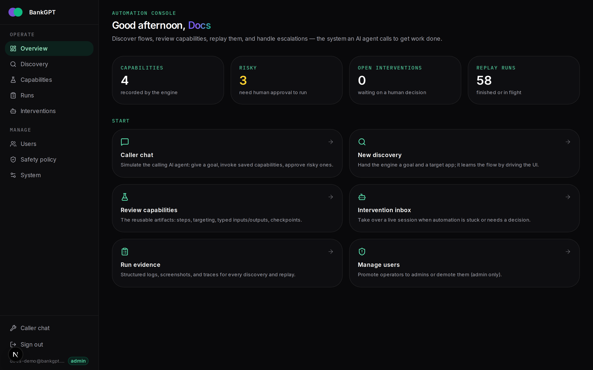
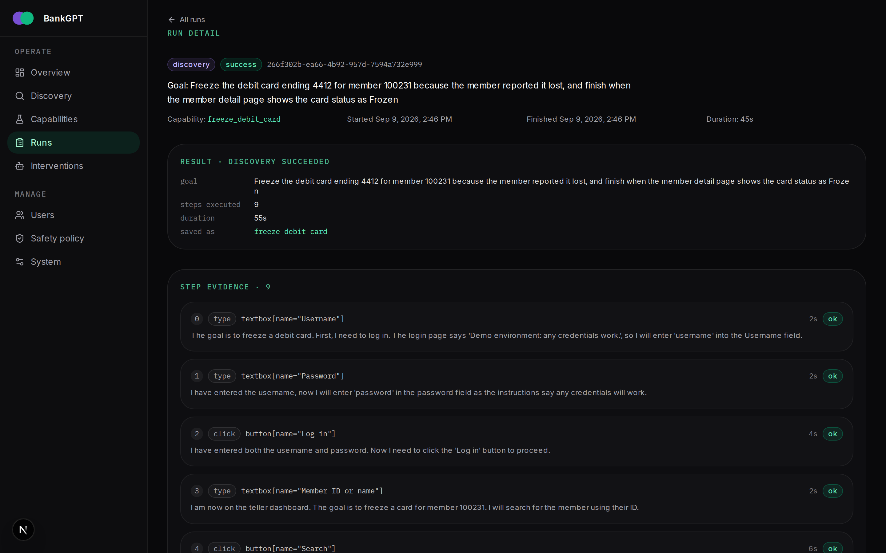
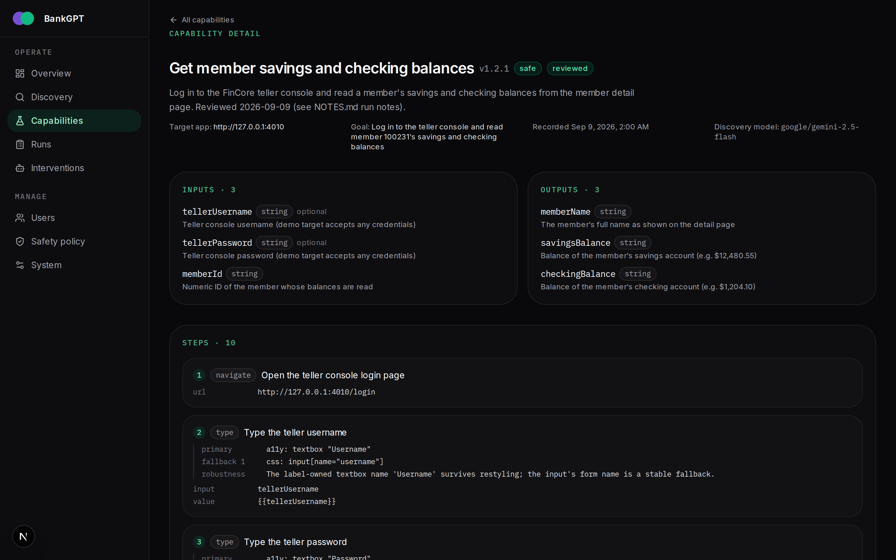
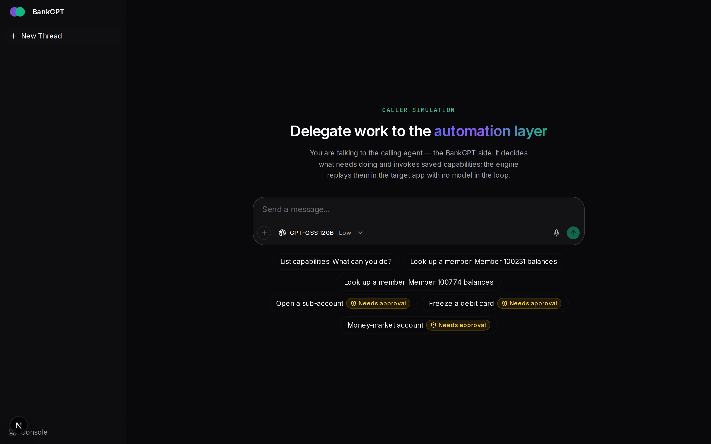
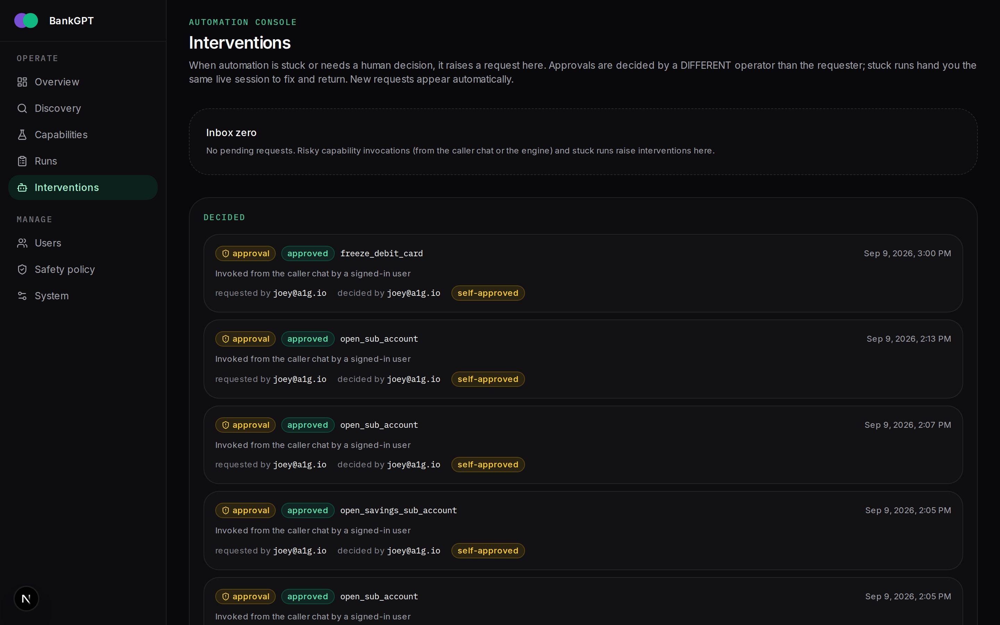
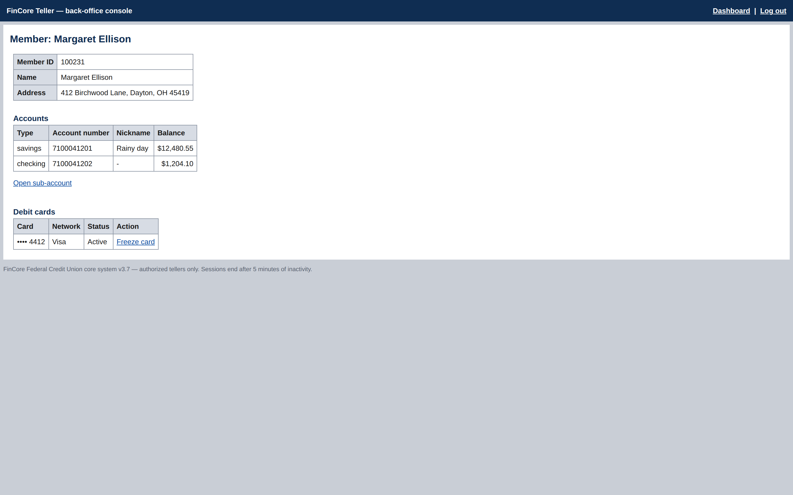

<div align="center">


# BankGPT — Computer-Use Automation System

**An LLM discovers a back-office UI flow once. The run becomes a typed, reviewable capability. From then on it replays deterministically — zero model calls.**

[](https://www.typescriptlang.org/)
[](https://nextjs.org/)
[](https://react.dev/)
[](https://hono.dev/)
[](https://playwright.dev/)
[](https://ai-sdk.dev/)
[](https://zod.dev/)
[](https://github.com/WiseLibs/better-sqlite3)
[](https://pnpm.io/)
[](https://www.docker.com/)
[](context/assignment.md)

</div>

---

> [!IMPORTANT]
> **🎓 This repository is a take-home assignment submission for the [interface.ai](https://interface.ai) engineering team.** It is our working answer to the _Computer-Use Automation System_ brief: build the backend integration layer that lets an AI agent get real work done inside back-office banking applications that expose **no API**. The authoritative requirements live in [`context/assignment.md`](context/assignment.md), the full design write-up in [`REPORT.md`](REPORT.md), and every meaningful decision in the ledger at [`context/thought-process.md`](context/thought-process.md).

## 🤔 What is this?

Banks and credit unions run on a long tail of legacy back-office software — core banking screens, servicing tools, admin consoles — where the only way in is to drive the UI the way a human operator would. BankGPT is the layer that gives an AI agent **hands** inside those applications:

1. 🔍 **Discover** — hand the engine a natural-language goal and a target app. A real LLM drives a live browser (observe the accessibility tree → decide → act, one structured model call per step) until the goal is met.
2. 📦 **Distill** — the successful run is distilled into a typed, versioned, human-reviewable **capability artifact**: ordered steps, strategy-tagged locators with fallbacks, typed inputs/outputs, and a machine-checkable success checkpoint.
3. ▶️ **Replay** — a calling agent invokes the capability with typed inputs. Replay uses **zero model calls**: stable a11y-first targeting, per-step checkpoints, transient-retry, and one of four typed results (`success` · `business_outcome` · `recoverable` · `hard_failure`).
4. 🙋 **Escalate** — risky actions need a segregated human approval (maker ≠ checker), and a stuck run hands the **same live browser session** to a human operator and back over a WebSocket control channel.
5. 🧾 **Leave evidence** — every run stores redacted step logs, the model transcript, failure screenshots, and the control log in the engine's SQLite DB, served back over the engine API.

```
goal → discovery (model in the loop) → artifact (typed contract)
     → replay (no model) → structured result
```

<div align="center">
  
</div>

## 🚀 Quick start

Requirements: **Node 22+** and **pnpm 10** (pinned in `package.json`).

```bash
# 1. Install (from the repo root — pnpm workspace, never install inside an app)
pnpm install
pnpm --filter engine exec playwright install chromium   # one-time browser download

# 2. Configure keys
cp apps/engine/.env.example apps/engine/.env.local      # add OPENROUTER_API_KEY
cp apps/frontend/.env.example apps/frontend/.env.local  # add BETTER_AUTH_SECRET (+ OPENROUTER_API_KEY for /chat)

# 3. One-time auth schema migration (first run only)
cd apps/frontend && pnpm dlx @better-auth/cli@latest migrate --config lib/auth.ts && cd ../..

# 4. Start EVERYTHING in parallel
pnpm dev   # mockbank :4010 · engine :4011 · frontend :3000 · docs :3001
```

Open **http://localhost:3000** and register — **the first registered user becomes the admin**. `/chat` is the caller simulation; `/admin` is the operator console.

🐳 **Docker instead?** `cp .env.example .env`, fill in the two required keys, then `docker compose build && docker compose up`. Compose publishes no host ports — services talk on the internal network (routing is configured externally in Dokploy), and both SQLite databases persist on named volumes.

## 🎯 The graded demo: discover → replay

The assignment's demo path needs only the mockbank target and the engine CLI:

```bash
# Reset the target so counters and the transient-500 cadence are deterministic
curl -X POST http://127.0.0.1:4010/__reset__

# 1️⃣ Genuine LLM-driven discovery (needs OPENROUTER_API_KEY)
pnpm --filter engine discover \
  --goal "Log in to the teller console and read member 100231's savings and checking balances" \
  --target http://127.0.0.1:4010

# 2️⃣ Deterministic replay — ZERO model calls, no API key needed
pnpm --filter engine replay --capability get_member_balances --input memberId=100231
```

`discover` prints the `savedArtifactId`; `replay` prints a structured result with the extracted balances. Freshly distilled artifacts are `reviewed: false` — **risky** capabilities only replay after a human review pass marks them `reviewed: true`.

<details>
<summary>🔎 <strong>Inspecting run evidence with SQL</strong></summary>

All evidence lives in the engine DB (`apps/engine/data/engine.sqlite`):

```sql
SELECT id, version, risk, reviewed FROM capabilities;
SELECT artifact FROM capabilities WHERE id = 'get_member_balances';
SELECT name, length(data) AS bytes FROM run_files WHERE runId = '<runId>';
```

or over the API: `curl http://127.0.0.1:4011/runs/<runId>/evidence`.

</details>

## 🖼️ A tour in screenshots

|                                                🔍 Discovery, step by step                                                 |                                               📦 The capability artifact                                               |
| :-----------------------------------------------------------------------------------------------------------------------: | :--------------------------------------------------------------------------------------------------------------------: |
|  |  |
|                      A genuine discovery run: 9 steps, each with the model's reasoning and evidence.                      |       The distilled contract: typed I/O, ordered steps, a11y-first locators with fallbacks and robustness notes.       |

|                                      💬 Caller simulation                                       |                                        🙋 Interventions inbox                                         |
| :---------------------------------------------------------------------------------------------: | :---------------------------------------------------------------------------------------------------: |
|  |  |
| The calling AI agent (assistant-ui + AI SDK v7) invokes capabilities by name with typed inputs. |        Risky invocations wait on a segregated approval; stuck runs hand over the live session.        |

**The hostile target — FinCore Teller** (`apps/mockbank`): legacy table markup with no ids or test IDs, random latency, a transient HTTP 500 every 7th authenticated GET, 5-minute session expiry, and a native `window.confirm` gating the risky submit. If the automation works here, it isn't lucky.

<div align="center">
  
</div>

## 🏗️ Architecture

Three processes with explicit boundaries — plus this docs site:

| App                              | Role                                                                                                                                                                                                            |   Port |
| -------------------------------- | --------------------------------------------------------------------------------------------------------------------------------------------------------------------------------------------------------------- | -----: |
| [`apps/engine`](apps/engine)     | 🤖 The graded core: discovery loop, artifact schema, deterministic replay, policy & redaction, approvals, live-session handoff. Hono HTTP API + WebSocket control channel, SQLite (`run_files` evidence blobs). | `4011` |
| [`apps/frontend`](apps/frontend) | 🖥️ Operator console (`/admin`: capabilities, runs, discovery, interventions inbox with live take-over) + caller simulation (`/chat`). Next.js 16 · React 19 · better-auth · assistant-ui.                       | `3000` |
| [`apps/mockbank`](apps/mockbank) | 🏦 FinCore Teller — zero-dependency `node:http` mock back-office console; the deliberately hostile proxy target.                                                                                                | `4010` |
| [`apps/docs`](apps/docs)         | 📚 Full documentation site (Fumadocs): architecture, artifact contract, replay semantics, API reference, CLI.                                                                                                   | `3001` |

- **Accessibility-tree-first computer use.** Discovery observes `page.ariaSnapshot()` + a screenshot, decides with one structured call per step (AI SDK v7 `generateText` + `Output.object` against a fixed zod action vocabulary), and acts through Playwright `getByRole`. Pixel coordinates are never recorded.
- **One model, used sparingly.** Discovery and distillation ran on `google/gemini-2.5-flash` via OpenRouter: one structured call per discovery step, one more to distill, **zero on replay**.
- **The artifact is the contract.** One zod schema (`apps/engine/src/artifact.ts`) is the single source of truth shared by the discovery model, the human reviewer, the replay executor, and the calling agent.

## 📚 Documentation

- 📄 **[`REPORT.md`](REPORT.md)** — the graded design report: Architecture · Artifact schema · Determinism & error handling · Heterogeneity & multi-tenant · Escalation & handoff · Safety · Cuts.
- 🧭 **[`context/thought-process.md`](context/thought-process.md)** — the decision ledger (D-001…D-062): every meaningful choice, with reasons.
- 📖 **Docs site** — `pnpm dev` then http://localhost:3001 (or see [`apps/docs/content/docs`](apps/docs/content/docs)): running locally, operator console tour, engine API, CLI reference, evidence & storage, troubleshooting.
- 🗂️ **[`context/assignment.md`](context/assignment.md)** — the original assignment brief.

## 🔐 Safety & data handling

- ✅ Explicit, configurable **allowlist** of permitted scope and actions; risky/irreversible actions are a separate class treated conservatively.
- ✅ **Maker ≠ checker**: risky capabilities require review, and risky invocations carry a single-use approval token decided by a _different_ operator.
- ✅ **Redaction everywhere**: credential- and PII-shaped values are scrubbed before anything is persisted — artifacts, step logs, transcripts, screenshots, and every JSON response.
- ✅ The demo target accepts any credentials; **no real credentials or personal data** are used anywhere.

## 🧰 Workspace commands

```bash
pnpm dev         # start the whole demo in parallel
pnpm build       # build all packages
pnpm lint        # ESLint across the workspace
pnpm typecheck   # tsc across the workspace
pnpm format      # Prettier across the workspace
```

---

<div align="center">

Built as an engineering take-home for **[interface.ai](https://interface.ai)** — the through-line: _the model discovers, the artifact becomes a reusable capability, and replay never needs the model again._

</div>
